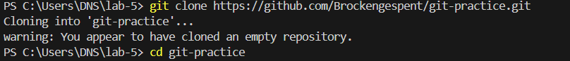
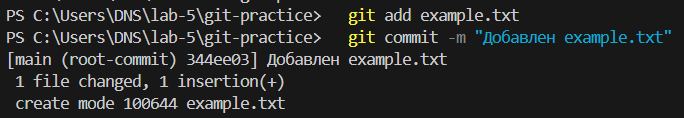
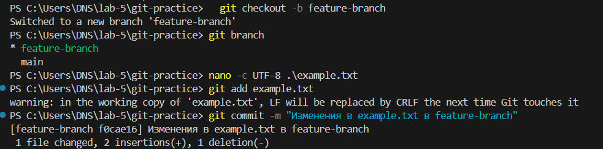
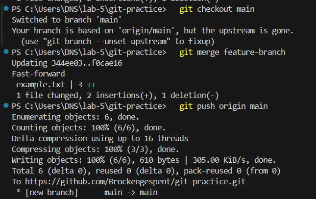
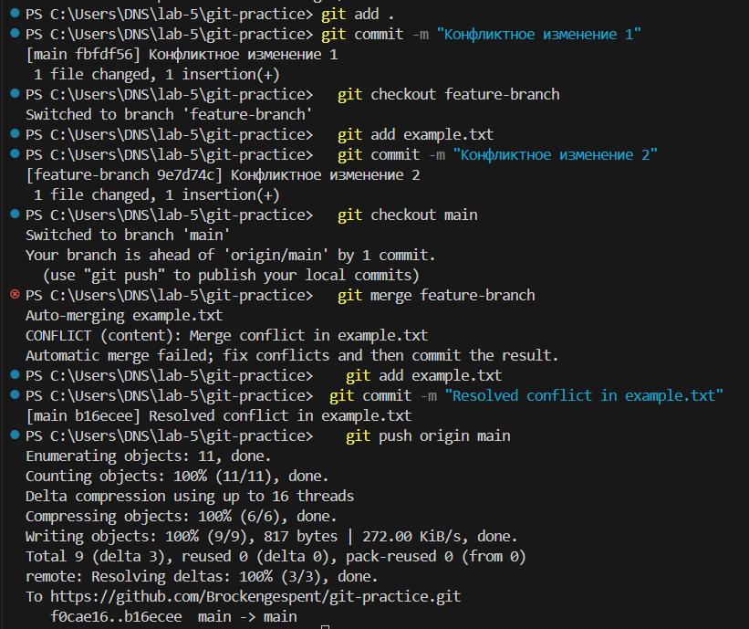
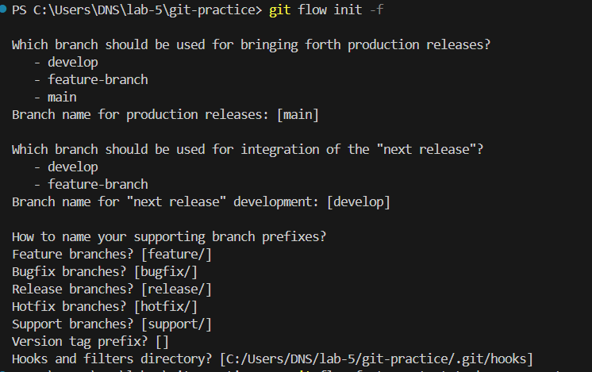
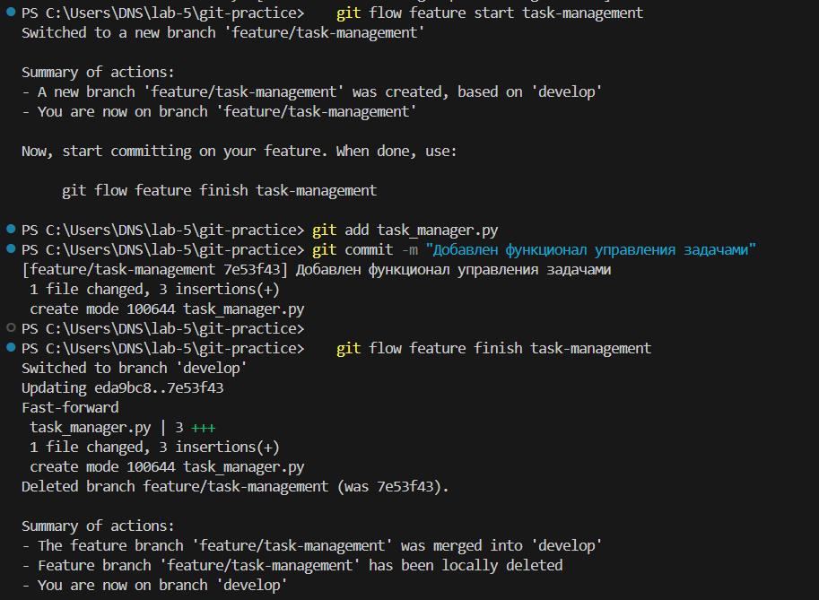
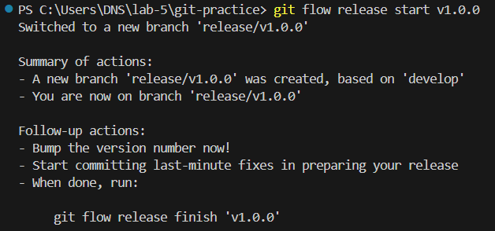
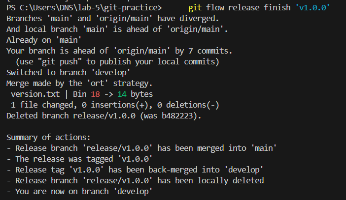
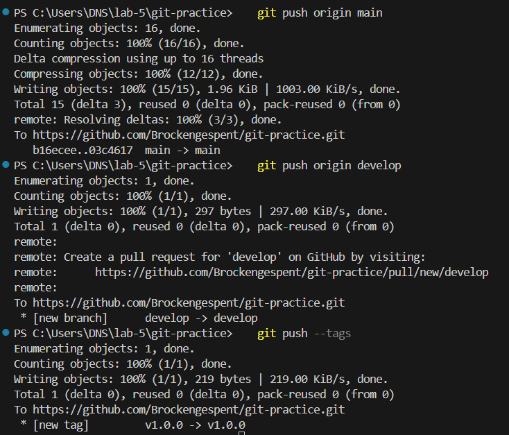

# Отчёт по лабораторной работе 5

## Введение
- Цель: Изучение продвинутых возможностей Git, включая работу с ветками, разрешение конфликтов и использование Git Flow.

## Выполненные действия


### Клонирование репозитория
- Команды:
  ```bash
  git clone https://github.com/Brockengespent/git-practice.git
  cd git-lab
  ```
- Скриншот: 

### Добавление файла
- Команды:
  ```bash
  echo "Текст" > example.txt
  git add example.txt
  git commit -m "File added example.txt"
  git push origin main
  ```
- Скриншот: .

### Работа с ветками
- Создание и переключение:
  ```bash
  git branch feature-branch
  git checkout feature-branch
  ```
- Скриншот: .

### Слияние изменений
- Команды:
  ```bash
  git checkout main
  git merge feature-branch
  git push origin main
  ```
- Скриншот: .

### Разрешение конфликтов
- Описание процесса:
  - Найдите конфликтные метки.
  - Удалите их и оставьте нужные изменения.
- Команды:
  ```bash
  git add README.md
  git commit -m "Resolved conflict in README.md"
  ```
- Скриншот: .

### Использование Git Flow
- Команды:
  ```bash
  git flow init
  git flow feature start task-management
  ```
- Скриншот: 

## Скриншоты





## Заключение
- Итоги: Все задачи выполнены успешно, конфликты разрешены, функциональность добавлена.
- Выводы: Получены навыки работы с ветками и разрешения конфликтов в Git.